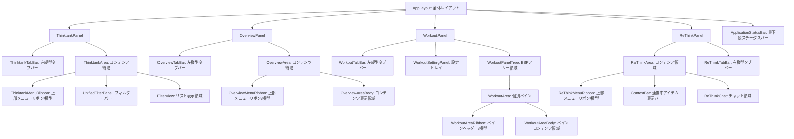

# Thinktank アプリケーション仕様書：02. UI・画面レイアウト仕様

本ドキュメントは、本アプリケーションの画面レイアウト構成、表示制御、およびメイン作業領域（WorkoutPanel）における二分空間分割（BSP）ツリーUIのアルゴリズムについて定義します。

---

## 1. 4パネルUIと基本レイアウト

画面は左から順に、以下の4つの主要パネルが横並びに配置されます。

```
┌────────────────┬────────────────┬────────────────────────────────┬────────────────┐
│  Thinktank     │  Overview      │        Workout Panel           │  ReThink       │
│  Panel         │  Panel         │                                │  Panel         │
│  （ダークブルー）│  （インディゴ）  │        （グレー）              │  （ダークグリーン）│
│  [幅: 240px]   │  [幅: 260px]   │        [幅: flex:1]            │  [幅: 260px]   │
└────────────────┴────────────────┴────────────────────────────────┴────────────────┘
```

各パネルの右側（ReThinkPanelのみ左側）には、ドラッグでパネル幅を変更可能な `<Splitter>` コンポーネントが配置されます。最小幅は一律 `120px` に制限されます。

### 1.1 4パネルUIと詳細レイアウト

アプリケーションを構成する各パネルおよび共通部品における詳細レイアウトと、各領域の呼称を定義します。各パネルは、ビューの切り替えやパネル開閉を担う「縦型のタブバー（側部）」と、具体的なデータ表示・絞り込みを行う「コンテンツ領域（エリア）」に二分され、エリア上部にはそれぞれのコンテキストに応じた「横型メニューリボン（上部）」が配置される二重リボン構造を持ちます。



#### ① 全体レイアウト (`app-container` / `app-layout`)
*   **メインコンテナ (`app-container`)**:
    *   画面全体を縦方向に制御し、パネル群を表示する `app-layout` と最下段のステータスバー `ApplicationStatusBar` を内包します。
*   **アプリ全体の表示領域 (`app-layout`)**:
    *   ステータスバーを除いた画面上部で、4つの主要パネルを横並びに制御します。
*   **仕切り領域 (`Splitter`)**:
    *   パネル間のリサイズを行うドラッグ領域。
*   **最下段ステータスバー (`ApplicationStatusBar`)**:
    *   アプリケーション全体の最下部に常時固定表示される横長バー。ステータス表示、正規表現による単語ハイライト、キーアクション履歴（フォーカス検出、入力キー、EXモード等）、CLIコマンドライン入力などの状態管理およびユーティリティを提供します。

#### ② 各パネルの詳細レイアウト領域

##### 1. ThinktankPanel（左パネル）
*   **左縦型タブバー領域 (`ThinktankTabBar`)**: パネルの左端。
    *   パネルの開閉（Toggle）、表示モード（一覧・AI・設定）の切り替えボタン、保管庫のロード中インジケータ、クラウド同期（on / off）のトグルスイッチなどが配置されます。
*   **コンテンツ領域 (`ThinktankArea`)**:
    *   **上部メニューリボン (`ThinktankMenuRibbon`)**: リストに対する一括操作（全選択・解除・削除）、新規Thought作成、AIチャットの保存、表示列・ソート設定などのアクションボタンが横並びで配置されます。
    *   **フィルター・検索領域 (`UnifiedFilterPanel` / `ThinktankSearchBar`)**: キーワード、更新・作成日時、ContentType（メモ/Thought/テーブル等）によるフィルタ入力欄。
    *   **データリスト領域 (`FilterView`)**: フィルタ結果のThink一覧がテーブル/カード形式で縦スクロール配置されます。

##### 2. OverviewPanel（中央左パネル）
*   **左縦型タブバー領域 (`OverviewTabBar`)**: パネルの左端。
    *   パネルの開閉（Toggle）、表示モード（Think一覧・関係グラフ・AIチャット・設定）の切り替えボタンが配置されます。
*   **コンテンツ領域 (`OverviewArea`)**:
    *   **上部メニューリボン (`OverviewMenuRibbon`)**: 選択中のThoughtからのThink除外、全選択・解除、新規Thought作成、AIチャットの保存などのアクションボタンが横並びで配置されます。
    *   **フィルター・検索領域**: 選択中Thought内のThinkに対するキーワード・日付フィルタ入力欄。
    *   **コンテンツ表示領域 (`OverviewAreaBody`)**: 選択したモード（グリッド一覧、Graph関係図、AIチャット、プロファイル設定）に応じた可視化・操作コンテンツを表示します。

##### 3. WorkoutPanel（中央右パネル - メイン作業領域）
*   **左縦型タブバー領域 (`WorkoutTabBar`)**: パネルの左端。
    *   設定トレイ（設定パネル）の開閉（Toggle）や、設定パネルのビューモード（ペイン管理・データ管理・環境設定等）の切り替えボタンが配置されます。
*   **設定トレイ領域 (`WorkoutSettingPanel`)**:
    *   `WorkoutTabBar` (左縦型タブバー) の操作で展開されるトレイ（幅変更可能）。ペインのスプリット操作、ファイルのインポート/エクスポートなどのコントロールが配置されます。
*   **メインコンテンツエリア**:
    *   **個別ペイン領域 (`WorkoutArea`)**: BSPツリーにより再帰分割された個別の編集・表示単位。
        *   **ペインヘッダー領域 (`WorkoutAreaRibbon`)**: ペインの上部（横型）。ドラッグハンドル、タイトル、保存状態（dirty）インジケータ、MediaType切替タブが配置されます。
        *   **ペインコンテンツ領域 (`WorkoutAreaBody`)**: Monaco Editor、Markdownレンダラー、かんばんボードなどのメイン表示・編集領域。


##### 4. ReThinkPanel（右パネル）
*   **右縦型タブバー領域 (`ReThinkTabBar`)**: パネルの右端。
    *   パネルの開閉（Toggle）、表示モード（AI相談・設定）の切り替えボタンが配置されます。
*   **コンテンツ領域 (`ReThinkArea`)**:
    *   **上部メニューリボン (`ReThinkMenuRibbon`)**: AI対話履歴の保存、チャットのスクロール操作などの横並びのアクションボタンが配置されます。
    *   **コンテキスト表示バー (`ContextBar`)**: 現在連携・同期している Thought または Think の名前を表示するヘッダーバー。
    *   **チャット表示領域 (`ReThinkChat`)**: AIとの CLI ターミナル風チャット対話ログおよびコマンド入力欄。

##### 5. 最下段ステータスバー (ApplicationStatusBar - アプリ全体最下部)
*   **配置箇所**: アプリケーション全体の最下部に常時固定表示（高さ 28px）。
*   **左端**:
    *   **起動モードインジケータ**: 現在の起動モード（Local / Online）を示すアイコンを表示。
    *   **テキスト入力エリア**: 現在選択されているモードに応じた入力・表示処理を行います。
*   **右端**:
    *   **モード切替ボタン群**: ステータス表示、単語ハイライト、キーアクション履歴、CLIコマンドラインなどのビューモード切り替えボタンが配置されます。
    *   **ユーティリティボタン**: コピーライト表示トグルボタンなどが配置されます。

### 1.2 レイアウトモード（LayoutMode）
画面表示全体の簡易表示を制御するために、以下の2つのモードが提供されます。設定値は `localStorage` の `tt-layout-mode` キーに保存されます。

*   **`standard` (デフォルト)**: 4パネルすべてを表示します。
*   **`compact`**: `OverviewPanel` と `ReThinkPanel` を非表示 (`display: none`) とし、`ThinktankPanel` と `WorkoutPanel` の2枚構成にします。

### 1.3 起動モードおよび同期設定のUI表示仕様
本システムは、動作環境に応じて異なる起動モード（Local / Online）で動作し、それに応じたインジケータおよび設定コントロールをUI上に配置します。

#### 起動モードインジケータの表示
*   **配置箇所**: 最下段ステータスバー（`ApplicationStatusBar`）の左端。
*   **アイコン表示仕様**:
    *   **Local モード**時: デスクトップ環境であることを示す **モニター（Monitor）アイコン** を表示。
    *   **Online モード**時: クラウド接続環境であることを示す **地球儀（Globe）アイコン** を表示。

#### クラウド同期設定のUIコントロール (Local モード専用)
*   **コントロール構成**: アプリケーション左端パネル（`ThinktankPanel`）の左縦型タブバー領域（`ThinktankTabBar`）内に、**クラウド同期オン/オフ切り替え用トグルスイッチ（またはチェックボックス）**を配置。
*   **挙動仕様**:
    *   現在モードが **Local モード** である場合のみ、このトグルが表示され、クリックによって `cloudSyncEnabled`（クラウド同期の有効化フラグ）の `true` / `false` を切り替えることができます。
    *   現在モードが **Online モード** の場合、このトグルは非表示とするか、操作不能（グレーアウト）とします（Onlineモードはクラウド接続が必須となるため）。
    *   トグル切り替えと同時に、UI状態管理（`__tt_ui_state__`）およびローカルストレージへ即座に設定値が永続化されます。

---

## 2. WorkoutPanel：BSPツリーレイアウト仕様

メイン作業領域（WorkoutPanel）は、画面を縦・横に何度でも分割できる**二分空間分割（BSP）ツリー**によりレイアウトされます。

### 2.1 データモデル
レイアウト構造は、ビューモデルの `panel.Layout` （`LayoutNode` 型）で表現され、TypeScript上で以下のように定義されます。

```typescript
export type LayoutNode = LeafNode | SplitNodeData;

export interface LeafNode {
  id: string;
  type: 'leaf';
  areaId: string; // 表示領域である TTWorkoutArea のインスタンスID
}

export interface SplitNodeData {
  id: string;
  type: 'split';
  direction: 'v' | 'h'; // v = 縦分割（左右に並ぶ）, h = 横分割（上下に並ぶ）
  first: LayoutNode;    // 左（または上）側の子ノード
  second: LayoutNode;   // 右（または下）側の子ノード
}
```

### 2.2 再帰的レンダリング
Reactコンポーネント内では、このツリー構造を再帰的に走査してDOMを構築します。
1.  **`LeafNode` のレンダリング**: 該当する `areaId` の `<WorkoutArea>` コンポーネントを配置します。
2.  **`SplitNodeData` のレンダリング**:
    *   親コンテナを `flex-direction: row` (v分割) または `column` (h分割) で描画します。
    *   `first` と `second` の各子ノードを包含するラッパー要素に対して、`splitRatios` から取得した比率 `ratio` （0.1〜0.9）を適用します。
        *   `first` 側の `flex` スタイル値: `ratio`
        *   `second` 側の `flex` スタイル値: `1 - ratio`
    *   2つの要素の間に、ドラッグ可能な `<Splitter>`（縦用）または `<WorkoutHSplitter>`（横用）を挟み込み、ドラッグ移動量に応じて `ratio` の値を動的に更新します。

---

## 3. ドラッグ＆ドロップ（D&D）によるペイン操作アルゴリズム

フロントエンドの他のパネルから Think アイテム（`application/x-thought-id`）をドラッグしてきたり、外部からファイルや URL をドロップしたりした際、WorkoutPanel のドロップ位置に応じてペインを追加または分割します。

### 3.1 ドロップエリア判定の閾値（定数）
*   `OUTER_RATIO = 0.15` (外縁 15%)
*   `NEW_PANE_FRAC = 0.35` (追加される新規ペインのデフォルト比率)

### 3.2 判定アルゴリズム (`computeDropOverlay`)
ドロップ先の座標（`clientX`, `clientY`）から、WorkoutPanel 全体の矩形に対する相対位置（`px`, `py` = 0.0〜1.0）を算出します。

#### ケースA：ペインが空の場合 (`Layout === null`)
*   画面全体を「新規追加先（右）」とし、全面にプレビューの緑オーバーレイを描画します。

#### ケースB：外縁追加（15%以内）
`px`, `1 - px`, `py`, `1 - py` のうち、最小の値が `OUTER_RATIO` (0.15) 未満の場合：
*   ドロップされた側の外縁に新ペインを追加（`type: 'add'`）します。
*   プレビュー範囲は、外縁から全体の `NEW_PANE_FRAC` (35%) の幅/高さを持つ長方形になります。
*   ドロップ時のアクション:
    *   左端: `panel.AddToLeft`
    *   右端: `panel.AddToRight`
    *   上端: `panel.AddToTop`
    *   下端: `panel.AddToBottom`

#### ケースC：内側分割（15%以上内側）
外縁判定から外れ、かつ特定のペイン（`WorkoutArea`）の上にある場合：
*   そのペインを2分割（`type: 'split'`）します。
*   分割方向は、そのペインの矩形に対するマウスの相対位置 `ax`, `ay` （ペイン中心が 0, 0、左上-0.5, 右下0.5）から決定します。
    *   `|ax| > |ay|` の場合: 左右に分割（`left` または `right`）
    *   `|ax| <= |ay|` の場合: 上下に分割（`up` または `down`）
*   プレビュー範囲は、対象ペインの半分（50%）を占める長方形になります。
*   **例外**: アプリケーション内のペイン数が **1個以下** の場合は、分割ドロップであってもすべて「外縁追加（`type: 'add'`）」に統一して処理します。
*   ドロップ時のアクション:
    *   左側: `panel.AddLeft`
    *   右側: `panel.AddRight`
    *   上側: `panel.AddAbove`
    *   下側: `panel.AddBelow`

---

## 4. ペイン同士の入れ替え (Swap)

各ペインのヘッダーバー（`<WorkoutAreaRibbon>`）のドラッグハンドルをマウスでホールドすると、ペインのドラッグ移動状態（Swapドラッグ）が開始されます。

*   ドラッグ開始時、マウスカーソルに追従するタイトルチップ（`workout-drag-ghost`）を描画します。
*   別のペインの上にドラッグしている間、対象ペインをドロップ候補として強調表示します。
*   ドロップしたとき、ドラッグ開始元の `AreaId` とドロップ先の `AreaId` を BSP ツリー上で入れ替えます（`panel.SwapAreas(fromId, toId)`）。

---

## 5. 幅と高さの均等化 (等分割) ロジック

ツリー内のペインサイズが不均等になった場合、以下のスロット換算アルゴリズムを用いて比率を均等に再配分します。

### 5.1 スロット数の算出
各ノードが占める「論理スロット数」を再帰的に算出します。

*   `LeafNode` のスロット数: `1`
*   `SplitNodeData` のスロット数:
    *   方向が対象方向（幅の均等化なら `v`）の場合: `firstの子ノードのスロット数 + secondの子ノードのスロット数`
    *   方向が対象外（幅の均等化なら `h`）の場合: `max(firstの子ノードのスロット数, secondの子ノードのスロット数)`

### 5.2 比率の算出
*   スロット数に基づいて、`SplitNodeData` の `ratio` を設定します。
```
ratio = (first のスロット数) / (first のスロット数 + second のスロット数)
```
この値をツリー内のすべての `split` ノードに対して適用することで、視覚的な均等分割を実現します。

---

## 6. ContentType と MediaType のマッピング

ペイン内で Think データを読み込むと、データの `ContentType` に応じて選択可能な表示形式（`MediaType`）が切り替わり、ペイン上部のリボンボタンが動的にフィルタされます。

| ContentType (データの種類) | 初期 MediaType | 選択可能な MediaType リスト |
| :--- | :--- | :--- |
| **`memo`** / **`nettext`** | `texteditor` | `texteditor` (Monaco), `markdown` (プレビュー) |
| **`thought`** | `datagrid` | `texteditor`, `datagrid`, `markdown`, `card` (かんばん風), `graph` (関係グラフ) |
| **`table`** | `datagrid` | `texteditor`, `datagrid`, `card` |
| **`chat`** | `chat` | `texteditor`, `chat` (AI対話ログ) |
| **`links`** | `texteditor` | `texteditor`, `markdown` |
