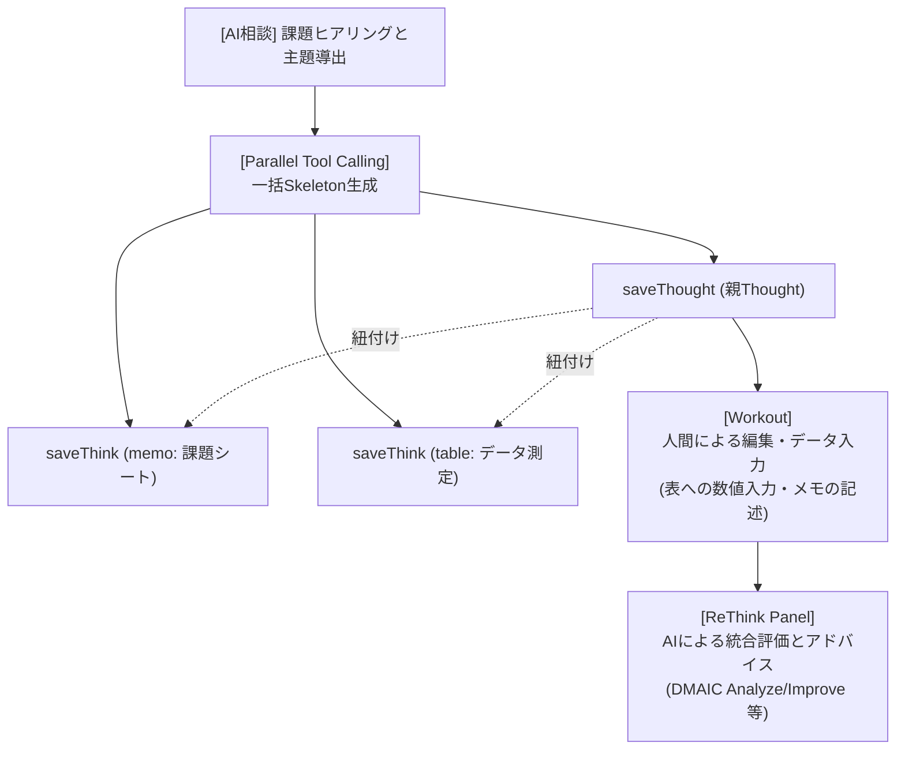

# 07_AIによるファイル自動作成と協調ワークフロー仕様

## 1. 概要と設計思想

本機能は、AIチャット（Antigravity）を通じて、ユーザーが抱える課題解決に必要なテンプレートファイル（Skeleton）を動的かつ自律的に作成し、それらをグルーピングしたThought（主題・入れ物）として自動構築する機能である。
AIが構造設計（スケルトンの生成）を行い、人間が詳細を肉付けし、最後にAIが全体を評価するという「AI ➔ 人間 ➔ AI」の協調的なアプローチ（Human-in-the-loop）を実現し、Thinktankにおける知的生産性を最大化することを目的とする。

---

## 2. AI主導のファイル自動作成・登録機能（実装仕様）

AI相談チャットは、Google Generative AI（Gemini）の **Parallel Tool Calling（並列ツール呼び出し）** および **AI自身による一意なIDの割り振り（1秒ずらしルール）** を使用して、対話の流れから自律的に親子ファイルを生成・関連付けする。

### 2.1 AIに提供されるアトミックツール

AIは対話の文脈に応じて、以下の単機能（アトミック）なツールを組み合わせて呼び出す。ツールは **書き込み系**（Vaultへの保存・更新）と **読み取り系**（データ参照・外部取得）の2種に分類される。

#### 書き込み系ツール（実行結果をSSEでユーザーに通知）

| ツール名 | 引数 | 役割 |
|---|---|---|
| `saveThink` | `id`, `category`, `title`, `content` | `memo` または `links` カテゴリのThinkファイルを新規作成・更新する |
| `saveThought` | `id`, `title`, `content` | 主題を束ねる親エントリ（category=`thought`）を新規作成する |
| `saveTable` | `id`, `title`, `content` | Markdownテーブル形式のデータ（比較表・一覧表）を category=`table` として保存する |
| `updateThought` | `id`, `appendIds[]` | 既存ThoughtのcontentにThink/Links/TableのIDを追記して紐付けを更新する |

**ID形式ルール**: AI自身が会話開始時刻を基準に1秒ずつ加算して生成する（例: `2026-07-04-150001-memo`、`2026-07-04-150002-thought`）。

**`saveThink` category 値一覧**:

| category値 | 用途 |
|---|---|
| `memo` | テキストメモ・ドキュメント |
| `links` | 外部URLリスト |

#### 読み取り系ツール（取得結果をAIに返してから次の返答を生成）

| ツール名 | 引数 | 役割 |
|---|---|---|
| `searchVault` | `keyword`, `category?` | Vaultを全文検索して既存のThink/Thoughtを見つける。`category`で絞り込み可（省略可）。先頭20件を返す |
| `getThink` | `id` | 指定IDのThink/Thoughtのタイトル・カテゴリ・本文を取得する。`updateThought`前の内容確認に使う |
| `fetchUrlContent` | `url` | URLにアクセスしてページタイトルと説明文（meta description）を取得する。Linksファイル作成前のURL確認に使う |

### 2.2 AIプロバイダー別ツール対応状況

ツール呼び出し（Tool Calling / Function Calling）の仕様は各社APIで異なる。現在のツール実装は **Gemini のみ対応**。

| プロバイダー | ツール対応 | 備考 |
|---|---|---|
| **Google Gemini** | ✅ 全7ツール対応 | `functionDeclarations` 形式。`SchemaType` を使用。多段ツール呼び出し対応 |
| Anthropic Claude | ❌ 未実装 | `input_schema` 形式でのツール定義が必要 |
| OpenAI GPT | ❌ 未実装 | `function.parameters` 形式でのツール定義が必要 |

> ツール実行ロジック（BQへの保存・検索処理）は `executeGeminiTool()` として共通化済み。他プロバイダー対応時は各社のAPI形式でのツール定義と検出コードを追加するだけでよい。

### 2.3 多段ツール呼び出し（Multi-turn Tool Calling）アーキテクチャ

読み取り系ツールはデータをAIに返す必要があるため、単発の呼び出しでは完結しない。`ChatService.ts` は以下の多段ループで処理する（最大5ターン）。

```
ターン1: AIが返答をストリーミング → function call を検出
         ↓
         書き込みツール → BQ保存 → SSEでユーザーに「登録完了」通知
         読み取りツール → BQ/URL取得 → 結果をAIに返す（SSE送信なし）
         ↓
ターン2: AIが取得結果を踏まえた返答をストリーミング → さらにfunction call があれば繰り返す
         ↓
終了:    function call がなくなったら done イベントを送信
```

**`done` イベント**: 最後に作成した Thought の ID（なければ最後に作成したアイテムのID）を `createdFileId` として返す。フロントエンドはこのIDを受け取り、画面の一覧を更新して該当ファイルを自動オープンする。

### 2.4 IDの自動決定と並列処理プロセス（解決策C）

1.  **AIによるID設計**:
    *   AIは会話のコンテキスト開始時刻を基準に、**1秒ずつ進めた重複しない日時ID** を自律的に割り振る。これにより、1ターンのレスポンス内で親子ファイルを同時に定義できる。
2.  **Parallel Tool Callの集約実行**:
    *   バックエンド（`ChatService.ts`）は、AIから同一ターンに返された複数のツール呼び出しを順次実行し、BigQueryに保存（`bigqueryService.save(record)`）する。
3.  **リアルタイムクライアント連携**:
    *   DB保存完了後、サーバーはSSEを通じて親ThoughtのIDを `done` イベントのメタデータ（`createdFileId`）としてフロントエンドに返却する。
    *   フロントエンド（`ThinktankArea.tsx`）は、このIDを受け取ると自動的に画面一覧を更新（`onRefresh()`）し、該当する親Thoughtファイルを即座にOverview/Workoutパネルに自動オープンする。

---

## 3. 課題解決フレームワークに基づく協調ワークフロー（将来ビジョン）

本仕様をベースとして、単一のテンプレート作成に留まらず、多角的なデータ構造とフレームワークを組み合わせた自律的な知見共有プロセスを実現する。



### 3.1 複合テンプレート（Skeleton）の自動構築
ユーザーからの抽象的な相談（例：「製品の欠陥率を下げたい」）に対し、AIは **Six Sigma (DMAIC)** などの高度な問題解決フレームワークを適用することを決定する。
AIは1つのThoughtの傘下に、以下のような異なるカテゴリのファイル群（Skeleton）を一度に生成してグルーピングする。

*   **Thought**: 「製品A 欠陥削減プロジェクト (DMAIC)」
*   **Think (category='memo')**: 「Define（目標・スコープ定義シート）」
*   **Think (category='table')**: 「Measure（欠陥発生頻度測定用データテーブル）」
*   **Think (category='links')**: 「参考になる品質管理ガイドライン」

### 3.2 人間とAIの役割分担（Intellectual Loop）

1.  **AIによる構造設計（Skeleton提供）**:
    *   AIがチャットを通じて適切なフレームワークを提案し、枠組み（空のテーブルやドキュメント構造）を即時に構築する。
2.  **人間による実作業・データ入力（Workout）**:
    *   ユーザーは提供されたSkeletonに基づき、Workoutパネルで数値を表に入力したり、調査内容をメモに記録する。
3.  **AIによる全体評価とアドバイス（ReThink）**:
    *   人間が入力したデータが集まった段階で、ユーザーは `ReThinkPanel` のChat機能を利用する。
    *   ReThinkは対象Thoughtに紐付いているすべての関連ファイル（データテーブルやメモ）を一括して読み込み、「欠陥の主原因分析（Analyze）」や「具体的な改善案（Improve）」を自動計算・アドバイスする。
